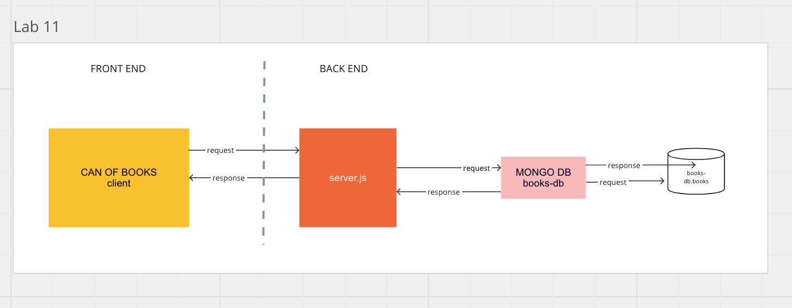

# Can of Books

**Author**: Heather Holcomb & Juan Olmedo

## Quick Links

- [Deployed App](https://can-of-books-lab-11.netlify.app/)
- [Deployed Server](https://can-of-books-backend-1g4p.onrender.com)
- [Front End Repo](https://can-of-books-lab-11.netlify.app/)
- [Back End Repo](https://can-of-books-backend-1g4p.onrender.com )
- [Trello Board](https://trello.com/b/Kh1btKiQ/can-of-books)
- [Team Agreement](https://docs.google.com/document/d/16s3W6gLlgHNnYluvPjqSdJSIg6N7Uu-PuS4wnatdupk/edit#)

## What can books do?

Books are life-changing. They have the power to enlighten, educate, entertain, heal, and help us grow. Build out this code base to create an web app to track what books have impacted you, and what's recommended to read next.

**Version**: 1.0.0 (increment the patch/fix version number if you make more commits past your first submission)

## Overview

Front end site to give suers a listing of books currently held in our developed back end

## Getting Started

npm install - to download all dependencies for project

## Architecture

## Main technologies used

- axios
- bootstrap
- react
- react-bootstrap

## Change Log

24 Apr 2023 - Application now has a fully-functional express server, with a GET route for the location resource.

## Credit and Collaborations

Heather Holocomb -  <https://github.com/holcombheather/can-of-books-backend>

## Estimates

Name of feature: __**Initial Front End**__________________________

Estimate of time needed to complete: **4 Hours**

Start time: _1400____

Finish time: _1900____

Actual time needed to complete: _5 Hours____

Name of feature: __**Day 2**__________________________

Estimate of time needed to complete: 5 hours____

Start time: _1600____

Finish time: _2030____

Actual time needed to complete: _4.5____

Name of feature: __**Initial Front End**__________________________

Estimate of time needed to complete: **4 Hours**

Start time: _1400____

Finish time: _1900____

Actual time needed to complete: _5 Hours____

Name of feature: __**Day 3**__________________________

Estimate of time needed to complete: 5 hours____

Start time: _1400____

Finish time: _2030____

Actual time needed to complete: _4.5____

## Partner Agreement

Logistical
What hours will you be available to communicate?
Juan: 2pm - 12am
Heather: 8am-9am; 1pm - 6pm; 8:30pm-12am
What platform will you use to communicate (ie. Slack, phone …)?
Slack - DM
Remo - Project Table on Floor 3
How often will you take breaks?
Every hour on the hour
What is your plan if you start to fall behind?
We will make sure we get TA help as needed.
Cooperative
Make a list of each person's strengths.
Juan:
JS
Server side js
Heather:
Front end
Design/CSS
Customer Profiles/Product Reqs
How can you best utilize these strengths in the development of your application?
We can use our strengths to either own that part of the project or if it’s something the other person wants to work on, then the other can use the strength in that area to review and help out when needed.
In what areas do you each want to develop greater strength?
Juan: I would like to be a better front end programmer more so in the areas of bootstrap. I would also like to understand server side programming more and use both APIs and Databases
Heather: I would like more practice manipulating state and using it for both APIs and DB calls.
Knowing that every person in your team needs to understand the code, how do you plan to approach the day-to-day development?
Stand Up Meetings every day for what we have done and what needs to be done.
Using Trello and keeping it up to date.
Use slack to update each other on changes/updates if we can’t meet in person.
Conflict Resolution
What will your team do if one person is pulling all the weight while the other person is not contributing?
We will each communicate the lack of contributions to the project in an honest and open manner. We both understand that this is a graded assignment and working together is key to this project.
What will your team do if one person is taking over the project and not letting the other member contribute?
We will ensure we remain open to any feedback anybody may have.
How will you approach each other and the challenge of building an application knowing that it is impossible for two people to be at the exact same place in understanding and skill level?
We will ensure we work together through any issues and help each other explain the code written by each person.

REPOS:
REPO-FRONT-END:   <https://github.com/carlitos-1988/can-of-books-frontend>
REPO-BACK-END: <https://github.com/holcombheather/can-of-books-backend>

Deployed sites:
Front End: <https://can-of-books-lab-11.netlify.app/>
Back End: <https://can-of-books-backend-1g4p.onrender.com>
